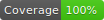

# Counted Storage

[](https://github.com/WendellAdriel/counted-storage/blob/master/LICENSE)
[](#contributors)


[![version][version-badge]][package]
[![downloads][downloads-badge]][npmcharts]
[![size][size-badge]][unpkg-dist] [![gzip size][gzip-badge]][unpkg-dist]

[![Watch on GitHub][github-watch-badge]][github-watch]
[![Star on GitHub][github-star-badge]][github-star]
[![Tweet][twitter-badge]][twitter]

Lightweight lib to work with the local storage implementing lifetime based on how many times the item was used

## How to use

Install the package

```
npm install counted-storage --save
// or with yarn
yarn add counted-storage
```

Import it and create your Counted Storage

```js
import CountedStorage from 'counted-storage'

const myStorage = CountedStorage('my_storage')
```

And that's it!!!
Check the **API Reference** below to check all that you can do with this package.

## API Reference

#### Creating a new storage

When creating a new Counted Storage, you need to give it a **namespace** and you can optionally pass a default validity
for the items in that storage. If you don't pass a default validity, the items in that storage will be valid for **1 use only**.
You can create as many storages as you want.

```js
import CountedStorage from 'counted-storage'

// This storage has the 'my_storage' namespace
// The items will have a default lifetime of 1 use
const myStorage = CountedStorage('my_storage')

// This storage has the 'my_second_storage' namespace
// The items will have a default lifetime of 5 uses
const mySecondStorage = CountedStorage('my_second_storage', 5)
```

#### get(key: String, defaultValue: any _[default: null]_): any

Checks if the Counted Storage has the item for the given key and returns if the item is found and if it's still valid,
otherwise returns the `defaultValue`

```js
import CountedStorage from 'counted-storage'

const myStorage = CountedStorage('my_storage')

// If the storage doesn't have this item, it will return null
myStorage.get('key')

// If the storage doesn't have this item, it will return 'default'
myStorage.get('key', 'default')
```

#### getAll(): Object

Returns an object with all the valid items for the Counted Storage

```js
import CountedStorage from 'counted-storage'

const myStorage = CountedStorage('my_storage')

// Returns an object in the following format: { first_key: first_value, second_key: second_value }
myStorage.getAll();
```

#### set(key: String, value: any, validFor: Number _[default: Storage default validity]_)

Sets an item on the Counted Storage with the given key. If `validFor` is given, this value will be used instead of the
default validity of the Counted Storage.

```js
import CountedStorage from 'counted-storage'

// This storage has the 'my_storage' namespace
// The items will have a default lifetime of 1 use
const myStorage = CountedStorage('my_storage')

// This item will be set with the default validity for this storage: 1 use
myStorage.set('my_key', { message: 'Hello, world' })

// This item will be set and will be valid for 3 uses
myStorage.set('second_key', 1000, 3)
```

#### remove(key: String)

Removes an item from the Counted Storage. You can have items with the same key in different Counted Storages.
This is possible using different namespaces for your Counted Storages. If you have items with the same key on
Counted Storages with different namespaces, the `remove()` function will remove the item only on the Counted Storage
that you called it.

```js
import CountedStorage from 'counted-storage'

const myStorage = CountedStorage('my_storage')

myStorage.set('my_key', { message: 'Hello, world' })

// Removes the item with the key 'my_key' from this Counted Storage
myStorage.remove('my_key')
```

#### clear()

Removes all items from the Counted Storage. This will not affect Counted Storages with different namespaces.

```js
import CountedStorage from 'counted-storage'

const myStorage = CountedStorage('my_storage')

myStorage.set('my_key', { message: 'Hello, world' })
myStorage.set('second_key', 1000, 10)

// Removes all the items from this storage
myStorage.clear()
```

## Contributors

Thanks goes to these wonderful people ([emoji key](https://github.com/kentcdodds/all-contributors#emoji-key)):

<!-- ALL-CONTRIBUTORS-LIST:START - Do not remove or modify this section -->
<!-- prettier-ignore -->
| [<br /><sub><b>Wendell Adriel</b></sub>](https://wendelladriel.com)<br />[💻](https://github.com/WendellAdriel/jodit-vue/commits?author=WendellAdriel "Code") [📖](https://github.com/WendellAdriel/jodit-vue/commits?author=WendellAdriel "Documentation") [💡](#example-WendellAdriel "Examples") [🤔](#ideas-WendellAdriel "Ideas, Planning, & Feedback") [⚠️](https://github.com/WendellAdriel/counted-storage/commits?author=WendellAdriel "Tests") |
| :---: |

<!-- ALL-CONTRIBUTORS-LIST:END -->

This project follows the [all-contributors](https://github.com/kentcdodds/all-contributors) specification. Contributions of any kind welcome!

[downloads-badge]: https://img.shields.io/npm/dm/counted-storage.svg?style=flat-square
[npmcharts]: http://npmcharts.com/compare/counted-storage
[version-badge]: https://img.shields.io/npm/v/counted-storage.svg?style=flat-square
[package]: https://www.npmjs.com/package/counted-storage
[size-badge]: http://img.badgesize.io/https://unpkg.com/counted-storage/dist/counted-storage.js?style=flat-square&label=size
[unpkg-dist]: https://unpkg.com/counted-storage/dist/counted-storage.js
[gzip-badge]: http://img.badgesize.io/https://unpkg.com/counted-storage/dist/counted-storage.js?label=gzip%20size&style=flat-square&compression=gzip
[github-watch-badge]: https://img.shields.io/github/watchers/WendellAdriel/counted-storage.svg?style=social
[github-watch]: https://github.com/WendellAdriel/counted-storage/watchers
[github-star-badge]: https://img.shields.io/github/stars/WendellAdriel/counted-storage.svg?style=social
[github-star]: https://github.com/WendellAdriel/counted-storage/stargazers
[twitter]: https://twitter.com/intent/tweet?text=Check%20out%20counted-storage!%20https://github.com/WendellAdriel/counted-storage%20%F0%9F%91%8D
[twitter-badge]: https://img.shields.io/twitter/url/https/github.com/WendellAdriel/counted-storage.svg?style=social
